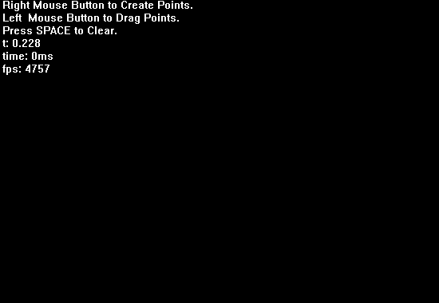

贝塞尔曲线
---------------------------------

动态演示贝塞尔曲线的绘制过程。支持任意点数、任意阶次.

### 编译环境
 * win10
 * Visual Studio 2019, v142
 * libEasyX, x86

### 操作说明
 * 点击鼠标右键，在鼠标位置将创建新的控制点.
 * 按住鼠标左键拖动控制点(有BUG).
 * 空格键屏幕将清空.

编译额好的二进制放在了 [`Releases`](https://github.com/luuyiran/bezier-curves/releases/tag/v0.2) 界面.

一起来玩一玩吧！

----------------------

贝塞尔曲线的更多知识：

1. [Wikipedia Bézier curve](https://en.wikipedia.org/wiki/B%C3%A9zier_curve).
2. [A Primer on Bézier Curves](https://pomax.github.io/bezierinfo/).

